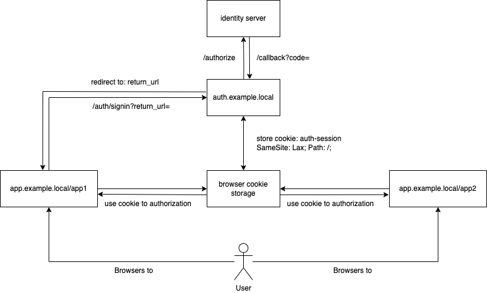
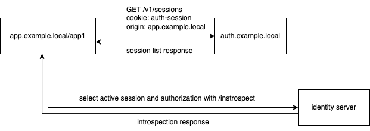

# Multiple OIDC sessions

Based on next-auth concept, the Auth application for managing multiple OIDC sessions.

## Flows

### Authentication



### Authorization



### End session


## Commands

### Pre-Dev 🙌

#### Install [Task](https://taskfile.dev/#/installation)

```sh
brew install go-task/tap/go-task
```

#### Get all tasks

```sh
task
```

#### Install packages

```sh
yarn install
```

#### Add hosts to `/etc/hosts`

```sh
echo "127.0.0.1 app.example.local auth.example.local" | sudo tee -a /etc/hosts > /dev/null
```

#### Generate New SSL certificates (Optional)

```sh
cd nginx

./openssl.sh
```

#### Trust the certificates (MacOS)

```sh
cd nginx

sudo security add-trusted-cert -d -r trustRoot -k /Library/Keychains/System.keychain localhost.crt
```

#### Start containers 🚀

```
task up
```

### Dev 👉

```
task dev
```

## Deploy

### Setup AWS EC2
